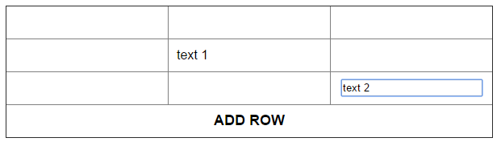

# Technical specification

## Task 1

Сверстать таблицу из 3-х строк и 3-х столбцов, в последней строке все ячейки объеденены в одну с текстом "Add row".

## Task 2

По клику на строку с "Add row" в начало таблицы добавляется новая строка.

## Task 3

При клике на любую ячейку таблицы, кроме находящейся в последней строчке, в этой ячейке появляется текстовый `input` с фокусом.

## Task 4

При потере фокуса, `input` должен исчезнуть, но на его месте остается введенный в него текст.

## Task 5

При клике на ячейку, которая уже содержит текст, появляется `input` с этим текстом (фактически, появляется возможность редактировать данные).

## *Task 6

Добавить событие по нажатию на клавишу `Enter`, для активного `input`. Событие работает так же, как потеря фокуса, т.е. прячет `input` и оставляет в ячейке текст.

## Requirements

- в таблице, в текущий момент, может находиться только один `input`
- использовать делегирование событий
