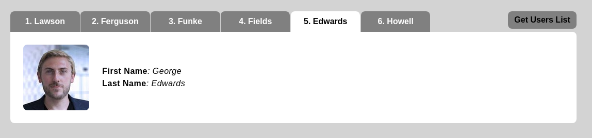

# Technical specification

## Task 1

Добавить на страницу кнопку "Get User List".

## Tasks 2

По клику на кнопку "Get User List" осуществляется AJAX request в external service [REQ | RES](https://reqres.in) для получения списка пользователей.

## Task 3

В случае ошибки получения данных, необходимо отрисовать на странице сообщение о том, что данные не получены. Для того, что бы воспроизвести ошибку, достаточно изменить  URL запроса

> Нижеприведенные задачи выполняются для случая, когда получение данных из external service произошло успешно.

## Task 4

Полученные данные должны записываться в LocalStorage

## Task 5

ДИНАМИЧЕСКИ добавить на страницу вкладки с информацией о пользователях:
- название вкладок должно быть `1. ${user.lastName}`, `2. ${user.lastName}` и т.д.
- при добавлении вкладок первая вкладка является активной
- для активной вкладки отображается блок с информацией о пользователе
- при клике на вкладку, она становится активной и отображается соответствующая информация

Example:

## Task 6

При загрузке страницы происходит проверка, есть ли данные в **LocalStorage**:
- если они есть, то, не отправляя AJAX запрос, отрисовывать их
- если нет, то отправить AJAX запрос, и предпринять действия в зависимости от успешности запроса
